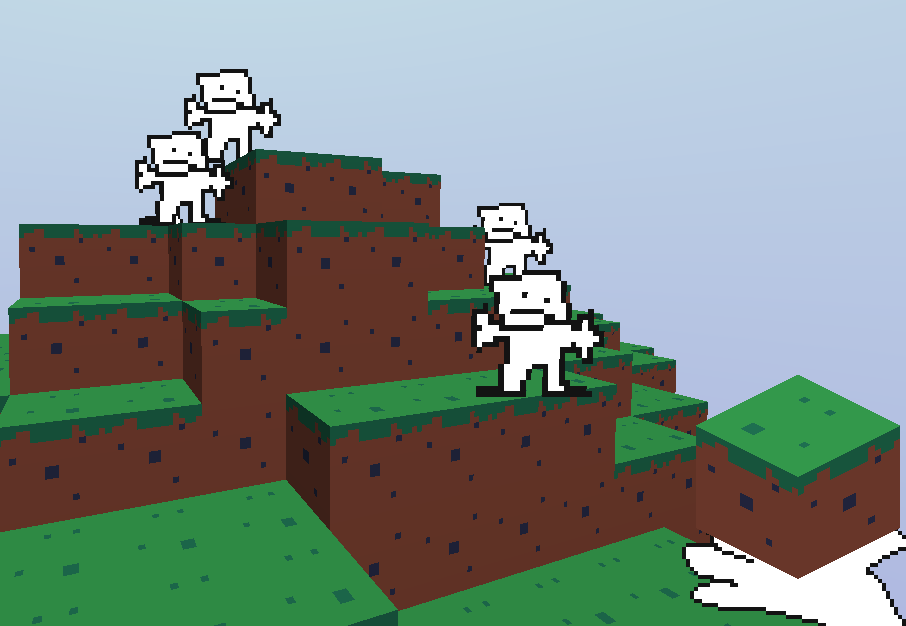
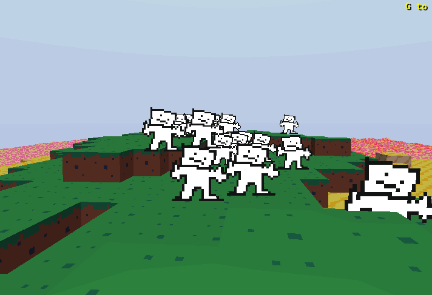

DINK ISLANDS
===

(click the image for some short showcase video)

A 13(ish) hour entry for [Minecraft in 24 Hours Jam](https://itch.io/jam/minecraft-in-24-hours)
 (This may or may not be a real game)

Disclaimer
===
This probably won't be maintained as it's nothing but a small tech demo project made for funs n' giggles

Special thank you(s) and stuffs
===
* [Main page for the jam](https://itch.io/jam/minecraft-in-24-hours)
* [rousr's ImGuiGML wrapper](https://rousr.itch.io/imguigml)
* [Scratchpixel's 3D DDA implementation](https://www.scratchapixel.com/lessons/advanced-rendering/introduction-acceleration-structure/grid)
